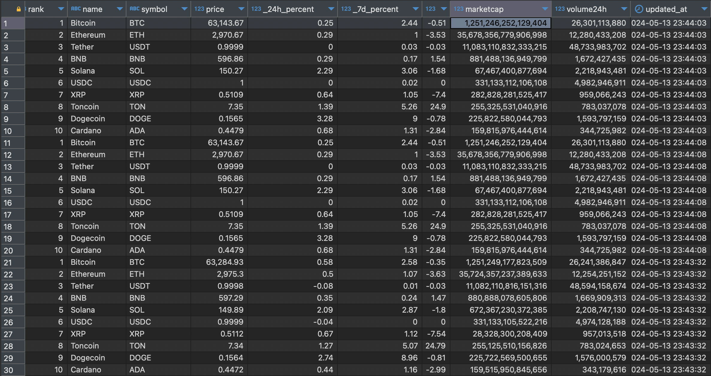

# **Objective**

The objective of this project is to develop a comprehensive system for the automated collection, processing, storage, and analysis of real-time data on the top 10 trending cryptocurrencies from the CoinMarketCap website. The system will provide actionable insights through detailed analytics, enabling users to make informed decisions based on up-to-date cryptocurrency trends.

- Tech stack: Apache Kafka, ClickHouse, Grafana, Docker, Python.

# **Architecture**


# **Sever**

| Service    | URL                    | User/Password |
| ---------- | ---------------------- | ------------- |
| Clickhouse | http://localhost:8123/ | default/''    |
| Grafana    | http://localhost:3000/ | admin/admin   |
| Kafka      | http://localhost:9092/ | ''/''         |

# **Data in Clickhouse**

- Data schema

```sh
root
 |-- updated_at: datetime
 |-- rank: int32
 |-- name: string
 |-- symbol: string
 |-- price: float32
 |-- _24h_percent: float64
 |-- _7d_percent: float64
 |-- _30d_percent: float64
 |-- marketcap: int64
 |-- volume24h: int64
```

- Data in database
  

# **Visualizing Data with Grafana**

  

# **Set up**

## **Pre-requisite**

### **Kafka**

- Setup Kafka service and start sending log data from website - Setup Grafana for data visualization [Setup](setup/kafka.md)

### **Clickhouse**

- Set up Clickhouse Docker and Clickhouse database to store data [Setup](setup/clickhouse.md)

### **Grafana**

- Setup Grafana for data visualization [Setup](setup/grafana.md)
